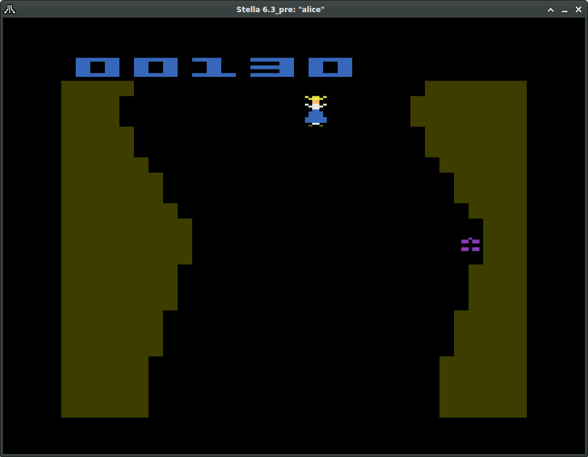

# vcs-alice
"Slithy Games: Alice In Wonderland" for the Atari VCS/2600

 Level 1: Follow the White Rabbit

 Level 2: Go down the rabbit hole!

Still to come: more levels with varying gameplay to help Alice make her way through Wonderland and back home.

## Build Instructions
Install cc65 and put the bin directory in your path. Then, run **build.sh** and a new **alice.bin** will be generated.

## Installation Instructions
Simply open **alice.bin** (either your own build or a [release](https://github.com/SlithyMatt/vcs-alice/releases)) with your favorite Atari 2600 emulator. It will need to be able to support Atari 32k banked ROMs.
